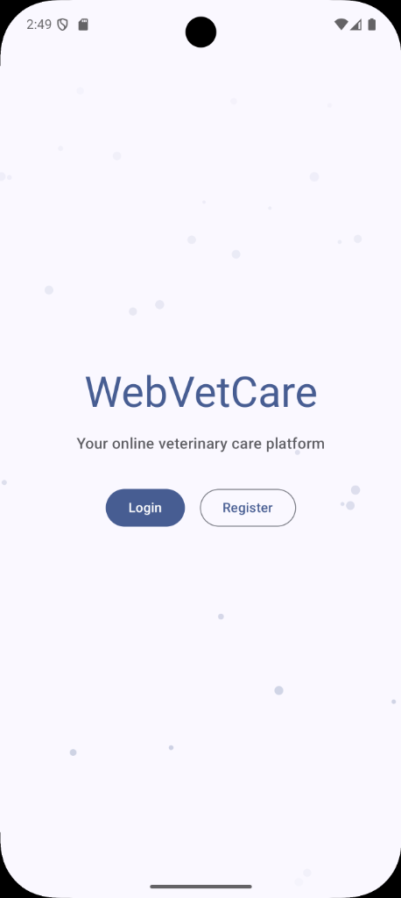
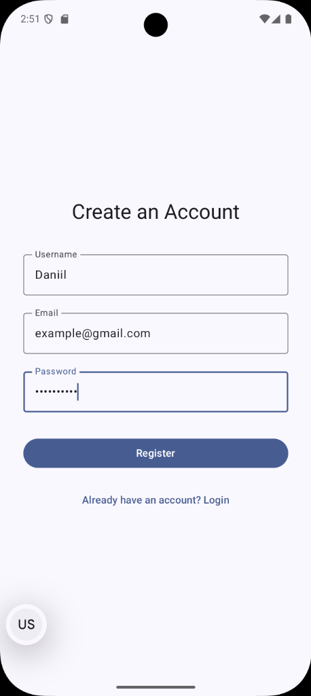
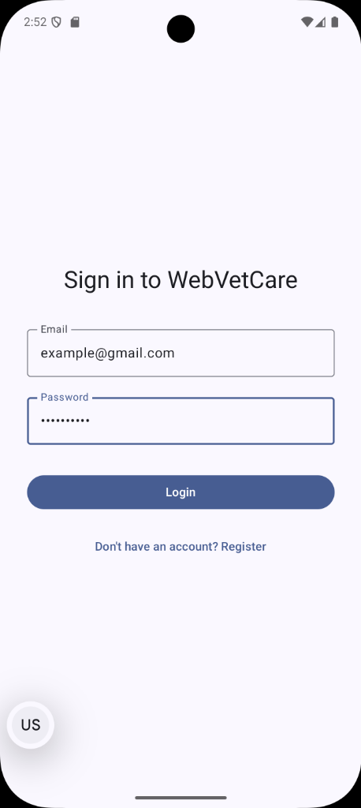
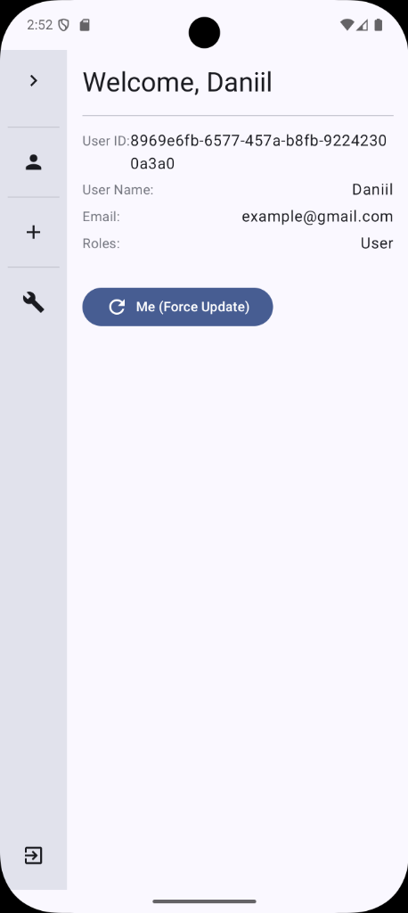
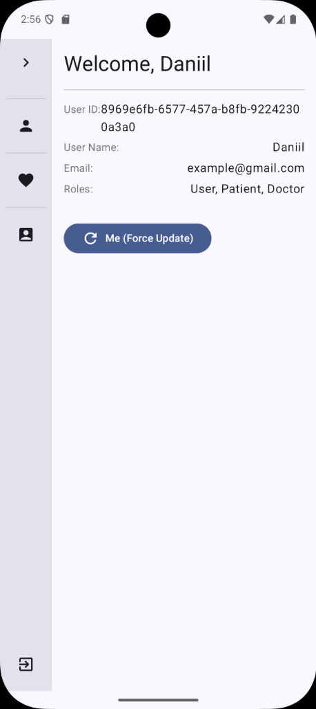
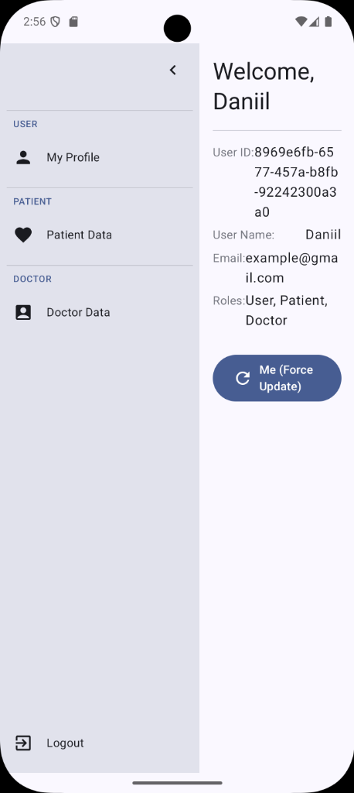
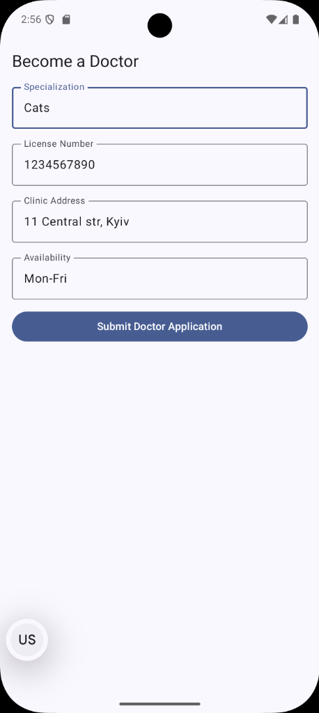
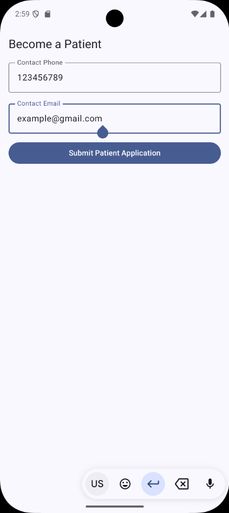
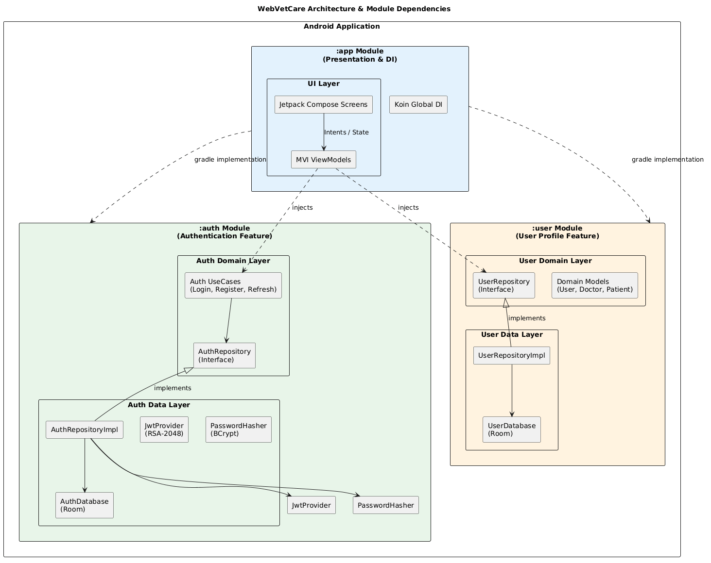

# WebVetCare

WebVetCare is a modern Android application built to connect veterinary doctors and pet owners. It provides a secure, locally-authenticated platform with distinct user roles (Doctor, Patient) and profile management.

## 📱 Screenshots










## 🏗 Architecture

The project strictly follows **Clean Architecture** principles and implements the **MVI (Model-View-Intent)** presentation pattern. It is deliberately multi-modular to enforce a one-way dependency graph and true separation of concerns.

### Modularization

*   **`:app`** (Presentation Layer)
    Contains Jetpack Compose UI, Navigation routing, MVI ViewModels, and the global Koin dependency injection graph. It depends on `:auth` and `:user` but never the other way around.
*   **`:auth`** (Authentication Feature)
    Handles user registration, login, and secure session management. It features a complete custom JWT implementation (RS256 signing via Android Keystore) and BCrypt password hashing.
*   **`:user`** (User Feature)
    Manages user entities, Doctor profiles, and Patient profiles. Uses Room database with Kotlin Flow for reactive UI updates (`@Relation` based schemas).

<!-- Placeholder: [Architecture Diagram] (Include a flowchart or diagram showing the dependency flow: :app -> :user, :app -> :auth, and the Clean Architecture layers mapping: UI -> Domain <- Data) -->


## 🛠 Tech Stack

*   **UI:** Jetpack Compose, Material Design 3
*   **Architecture:** Clean Architecture + MVI
*   **Dependency Injection:** Koin
*   **Local Persistence:** Room Database, EncryptedSharedPreferences (for JWT storage)
*   **Security:** BCrypt (cost factor 12), RSA-2048 (JWT signing/verification)
*   **Asynchrony:** Kotlin Coroutines & Flow

## 🚀 Setup & Build Instructions

### Requirements

*   **Android Studio:** Ladybug / Koala (or newer)
*   **JDK:** Java 17
*   **Android SDK:** Min SDK 28 / Target SDK 35

### Running the App

1.  Clone the repository:
    ```bash
    git clone https://github.com/WantonOoze23/WebVetCare.git
    ```
2.  Open the project in Android Studio.
3.  Let Gradle sync automatically.
4.  Run the `app` configuration on an emulator or physical device.

### Running Tests

The project includes extensive unit and instrumented tests for domain logic, database operations, and security components.

```bash
# Run unit tests across all modules
./gradlew testDebugUnitTest

# Run instrumented tests
./gradlew connectedDebugAndroidTest
```
